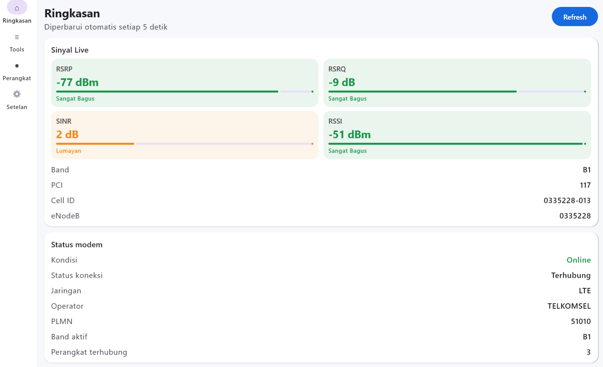
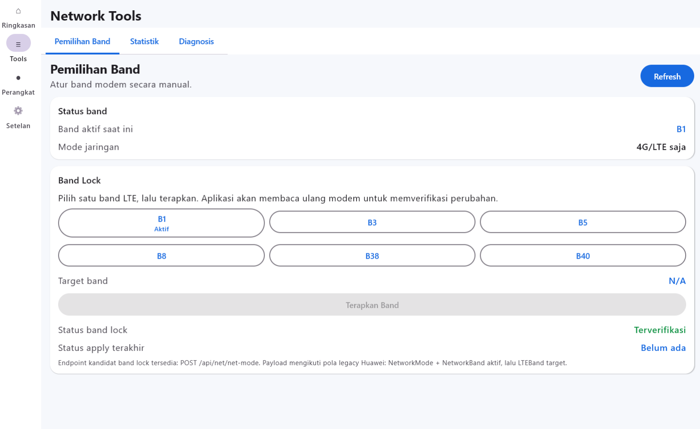
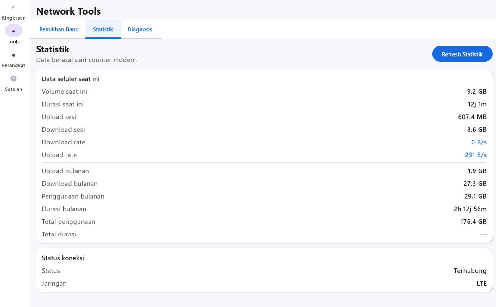

# Orbit Control

Orbit Control adalah aplikasi manajemen modem untuk Huawei/Orbit B312
yang berkomunikasi langsung melalui Huawei HiLink API pada jaringan lokal.

## Screenshot

### Dashboard / Ringkasan

<p align="center">
  
</p>

### Band Lock

<p align="center">
  
</p>

### Statistik

<p align="center">
  
</p>

## Download

Jika Anda hanya ingin menggunakan Orbit Control, unduh aplikasi
siap pakai melalui halaman **Releases**.

### Android

- `Orbit-Control-0.5.0-Android.apk`

### Windows

- `Orbit.Control-0.5.0-Windows-Setup.exe` — direkomendasikan
- `Orbit.Control-0.5.0-Windows.msi`

### Linux

Binary Linux belum tersedia pada v0.5.0.
Source code Linux tersedia pada folder `linux/`.

> Android membutuhkan minimal Android 7.0 (API 24). Untuk Windows, target rilis utama adalah Windows 10/11 x64.

## Fitur utama

- Login ke modem melalui Huawei HiLink API.
- Dashboard status modem, operator, traffic, WAN/LAN, perangkat, dan metrik sinyal.
- **Band Lock LTE manual** dengan konfirmasi dan verifikasi konfigurasi setelah perubahan.
- Statistik penggunaan dari counter modem.
- Diagnosis koneksi berbasis HTTP latency.
- Daftar perangkat yang terhubung.
- Informasi firmware dan status teknis modem.
- Export Debug Report tanpa menyertakan password, SessionID/token, IMEI, atau serial number.

## Cara menggunakan

1. Sambungkan perangkat ke Wi-Fi/LAN modem Huawei/Orbit B312.
2. Jalankan Orbit Control.
3. Masukkan alamat modem. Default yang umum digunakan adalah `http://192.168.8.1`.
4. Masukkan username dan password modem.
5. Gunakan **Test Koneksi** bila diperlukan, kemudian pilih **Masuk**.
6. Gunakan menu **Ringkasan**, **Tools**, **Perangkat**, dan **Setelan** untuk mengelola modem.

Password modem tidak disimpan. Bila opsi penyimpanan konfigurasi digunakan, aplikasi hanya menyimpan host dan username.

## Source code

Repository ini menggunakan struktur berikut:

```text
OrbitControl/
├── android/     # Android — Kotlin + Jetpack Compose
├── windows/     # Windows — Kotlin + Compose Desktop
├── linux/       # Linux — Kotlin + Compose Desktop
├── CHANGELOG.md
└── README.md
```

Masing-masing folder platform memiliki `README.md` sendiri dengan petunjuk build yang lebih spesifik.

## Teknologi

- Kotlin
- Jetpack Compose
- Compose Desktop
- OkHttp
- Kotlin Coroutines
- Huawei HiLink API
- XML API parsing

## Build Android

Persyaratan utama:

- JDK 17
- Android SDK Platform 35
- Android SDK Build Tools 35.x

Masuk ke folder `android`, kemudian jalankan:

```bat
gradlew.bat assembleDebug
```

Untuk distribusi publik, gunakan **signed release APK**, bukan debug APK.

## Build Windows

Persyaratan utama:

- Windows 10/11 x64
- JDK 17 x64

Masuk ke folder `windows`, kemudian jalankan:

```bat
build-windows.bat
```

atau:

```bat
gradlew.bat packageDistributionForCurrentOS
```

Installer `.exe` dan `.msi` akan dibuat di:

```text
build/compose/binaries/main/
```

Java runtime disertakan dalam paket desktop sehingga pengguna akhir tidak perlu memasang Java secara terpisah.

## Build Linux

Persyaratan utama:

- Linux x64
- JDK 17
- `dpkg-deb` untuk `.deb` dan/atau `rpmbuild` untuk `.rpm`

Masuk ke folder `linux`, kemudian jalankan:

```bash
bash build-linux.sh
```

Paket akan tersedia di:

```text
build/compose/binaries/main/
```

## Kompatibilitas dan batasan

Orbit Control dikembangkan dengan fokus pada **Huawei/Orbit B312**. Endpoint HiLink, field XML, autentikasi, dan kemampuan Band Lock dapat berbeda tergantung firmware dan operator.

Band Lock merupakan fitur eksperimental. Gunakan hanya jika Anda memahami band LTE yang digunakan modem. Aplikasi melakukan verifikasi pembacaan ulang setelah perubahan, tetapi kompatibilitas tetap bergantung pada firmware perangkat.

## Kontribusi

Kontribusi pengembangan, laporan bug, dan perbaikan kompatibilitas dipersilakan melalui **Issues** atau **Pull Requests** setelah kebijakan kontribusi dan lisensi proyek ditentukan.

Saat melaporkan masalah, jangan membagikan password modem, SessionID, verification token, IMEI, atau serial number.

## Changelog

Lihat [`CHANGELOG.md`](CHANGELOG.md) untuk riwayat perubahan versi.

## Lisensi

Orbit Control didistribusikan di bawah [MIT License](LICENSE).

Copyright © 2026 Ahmad Asyhari (Andros Programmer).

## Disclaimer

Orbit Control adalah proyek independen dan bukan aplikasi resmi Huawei maupun Telkomsel Orbit. Nama dan merek dagang terkait tetap menjadi milik pemegang hak masing-masing.
